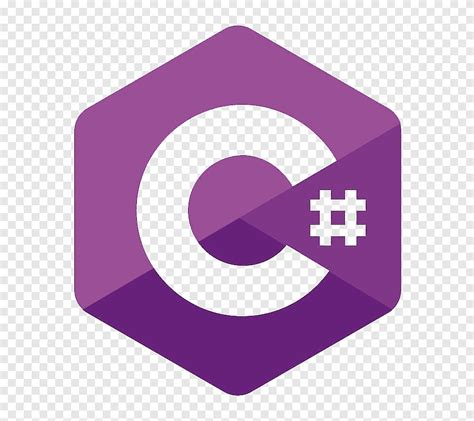
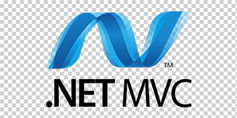
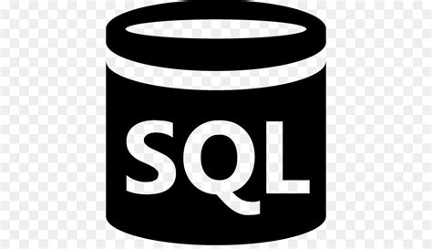
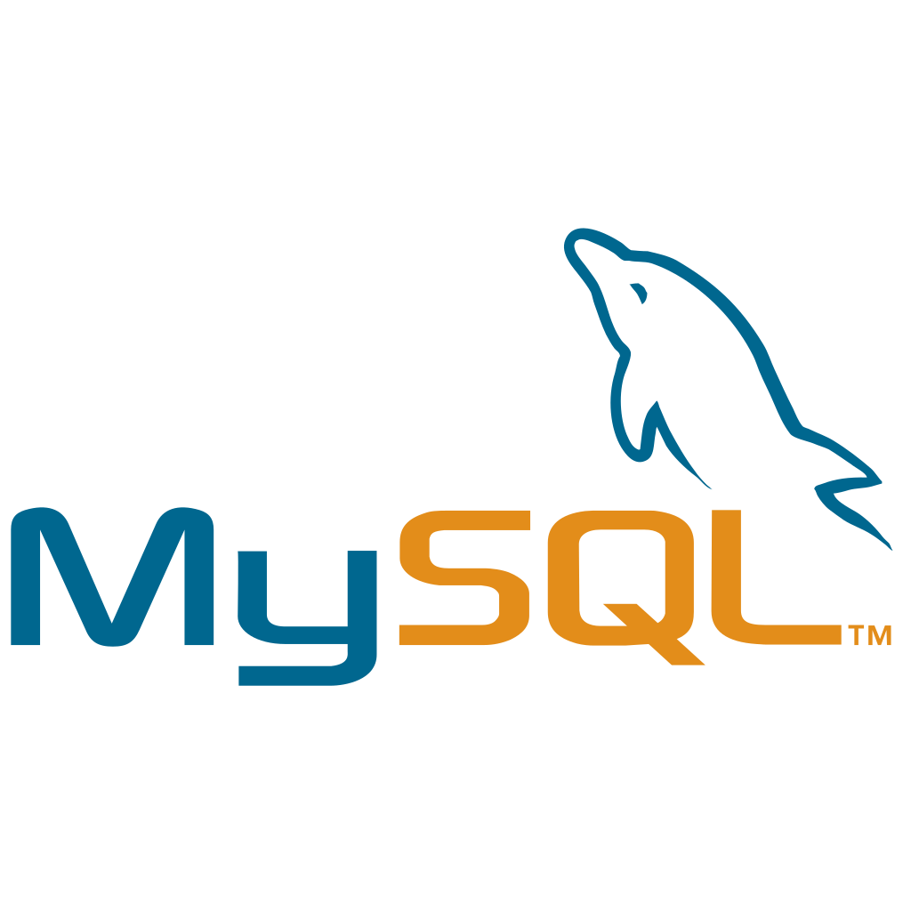
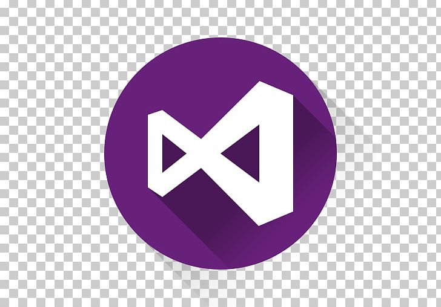

### Hello World! I’m Albert Pipió Adroher
- 👀 I'm interested in Back-End Web Development (.NET)
- 🌱 I'm currently learning Hexagonal Architecture and Agile.
- 💞️ I’m looking to contribute on exciting projects where I can contribute with my skills and knowledge.
- 📫 Contact: albertpipio@gmail.com

### Some Stats:

  
  <!--img  src="https://github-readme-stats.vercel.app/api?username=gerardpuigl&show_icons=true&locale=en" alt="gerardpuigl" /-->

### Technology Stack:

  
  
  
   
   
  
  
  
  
  
  
  
  
  
  
 
